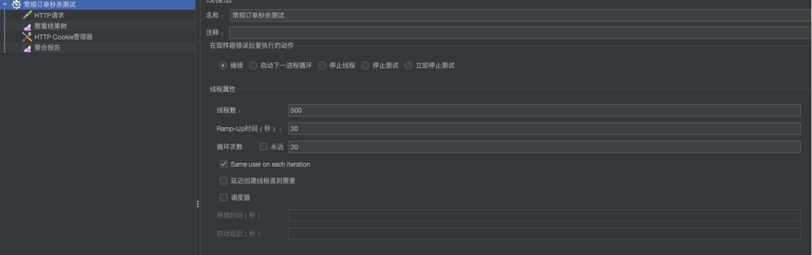

## 项目效果展示

* [1.简易RPC框架实现](#1)
    * [1.1 项目介绍](#1.1)
    * [1.2 项目技术](#1.2)
    * [1.3 项目设计](#1.3)
    * [1.4 项目展示](#1.4)
        * [1.4.1 RPC服务端启动](#1.4)
        * [1.4.2 RPC客户端启动及服务调用](#1.5)
        * [1.4.3 服务变更通知](#1.6)
* [2.点点秒杀](#2)
    * [2.1 项目介绍](#2.1)
    * [2.2 项目技术](#2.2)
    * [2.3 担任角色](#2.3)
    * [2.4 核心方案](#2.4)
    * [2.5 压测展示](#2.5)
        * [1.4.1 RPC服务端启动](#1.4)
        * [1.4.2 RPC客户端启动及服务调用](#1.5)
        * [1.4.3 服务变更通知](#1.6)
    * [2.6 项目收获](#2.6) 

<h2 id="1">校园点点餐</h2>
<h3 id="1.1">项目介绍</h3>
项目用于高效餐厅服务的一款点餐应用，项目的现实意义是缓解餐厅高峰期就餐拥挤，节约商家和学生
时间，项目实现了餐厅点餐、餐厅外卖、餐厅排队、外卖送餐等操作。项目部署云服务器，在学校餐厅2个窗口进行了业务功能的测试。
- 1.	餐厅点餐模块：营业时间内，任意时刻手机点餐。
- rpc-provider 模块实现 RPC 框架服务端的启动，rpc-consumer 模块实现 RPC 框架客户端的启动。
- rpc-interfaces 模块提供了 RPC 服务。

<h3 id="1.2">项目技术</h3>
Spirng+Netty+ZooKeeper+Protostuff+cglib 

<h3 id="1.3">项目设计</h3>
- 使用 Spring IoC，将对象之间的相互依赖关系交给 IoC 容器管理，并由 IoC 容器完成对象的注入。
- 使用 Spring XML schema，实现了用 xml 配置来使用 RPC 框架。
- 使用 Netty 作为客户端和服务器的通信实现方案，使用主从 Reactor 多线程模型将客户端连接请求
和业务处理分别由不同线程池完成，通过实现 Netty 预置编解码器，解决粘包问题。
- ZooKeeper 作为服务的注册中心，实现服务的暴露和引用。
- 通过 ZooKeeper 的 Watcher 机制，实现客户端对服务变更的监听。
- 使用 cglib 作为动态代理实现方案，log4j 作为打印和输出方案，Protostuff 作为序列化实现方案。

<h3 id="1.4">RPC服务端启动</h3>

<h3 id="1.5">RPC客户端启动及服务调用</h3>

<h3 id="1.6">服务变更通知</h3>

<h2 id="2">点点秒杀</h2>
<h3 id="2.1">项目介绍</h3>
项目的主要用于电商的高峰期秒杀，业务模块主要实现了用户、商品、订单和秒杀。
- 用户模块：集中管理用户的登录凭证、缓存用户信息。
- 商品模块：商品详情、缓存商品信息。
- 订单模块：异步扣减库存。
- 秒杀模块：削峰限流与防刷。
<h3 id="2.2">项目技术</h3>
SpringBoot + Spring + SpringMVC + MySQL + MyBatis + Guava Cache + Redis + RocketMQ

<h3 id="2.3">担任角色</h3>
- 需求简单分析以及架构设计
- 后端接口设计
- 数据库部份表以及索引设计
- 完成系统评分模块以及分数计算展示模块 JAVA 后端接口开发

<h3 id="2.4">核心解决方案</h3>
- 采用Guava Cache + Redis构建二级缓存，来缓存商品信息，极大的提高了商品详情也的QPS。
- 采用Redis缓存库存信息，使用RocketMQ的事务性消息实现异步扣减库存，极大的提高了下单操作的TPS，并且保证了最终数据的一致性。 统吞吐量从约130/s 提升到约1900/s，峰值2300/s。
- 采用 令牌+大闸+队列 的方式进行削峰，极大的降低了下单接口的流量。
- 采用 验证码来平滑用户流量，以此将洪峰从1秒分摊到5秒。
- 采用 令牌桶算法进行限流，限制单机TPS,保证服务的可用性。

<h3 id="2.5">压测展示</h3>
#### 【秒杀压测】常规
计算每一年课题组各指标平均分和总平均分，展示在主页当中

#### 【秒杀压测】增加缓存和异步扣减库存

<h3 id="2.6">项目收获</h3>