## 项目效果展示

* [1.校园点点餐](#1)
    * [1.1 项目介绍](#1.1)
    * [1.2 项目技术](#1.2)
    * [1.3 担任角色](#1.3)
    * [1.4 设计特色](#1.4)
    * [1.5 设计特色](#1.5)
        * [1.5.1 首页和点餐](#1.5.1)
        * [1.5.2 认证和排队](#1.5.2)
        * [1.5.3 登录和订单](#1.5.3)
        * [1.5.4 视频展示](#1.5.4)
    * [1.6 设计特色](#1.6)
* [2.点点秒杀](#2)
    * [2.1 项目介绍](#2.1)
    * [2.2 项目技术](#2.2)
    * [2.3 担任角色](#2.3)
    * [2.4 核心方案](#2.4)
    * [2.5 压测展示](#2.5)
        * [2.5.1 【秒杀压测】常规](#2.5.1)
        * [2.5.2 【秒杀压测】增加缓存和异步扣减库存](#2.5.2)
    * [2.6 项目收获](#2.6) 

<h2 id="1">校园点点餐</h2>
<h3 id="1.1">项目介绍</h3>
项目用于高效餐厅服务的一款点餐应用，项目的现实意义是缓解餐厅高峰期就餐拥挤，节约商家和学生时间，项目实现了餐厅点餐、餐厅外卖、餐厅排队、外卖送餐等操作。项目部署云服务器，在学校餐厅2个窗口进行了业务功能的测试。
- 餐厅点餐模块：营业时间内，任意时刻手机点餐。
- 餐厅外卖模块：在手机点餐的基础上，可以选择需要配送服务。
- 餐厅排队模块：快餐类窗口，直接线上支付并排队，省去常规支付时间。
- 外卖送餐模块：餐厅就餐同学可以主动选择需要配送的餐品进行配送，赚取小费。

<h3 id="1.2">项目技术</h3>
SpringBoot + SpringBootJpa + Redis + MySQL + Nginx + Postman + API文档

API文档地址：[点击直达](https://www.showdoc.com.cn/diandiancan)

<h3 id="1.3">担任角色</h3>
- 需求简单分析以及整体架构设计
- 前后端API接口设计
- 数据库表设计
- 后端各部分模块开发

<h3 id="1.4">设计特色</h3>
- 前后端分离开发，书写接口文档的编写。
- 设计接口返回数据的包装类，项目的前后端个交互更加简洁清晰。
- 过滤非必要字段，减少IO压力，敏感数据查库验证，确保数据的一致性和安全性。
- 使用SpringBoot和SpringBootJpa让约定大于配置提高开发效率，Maven构建管理项目。

<h3 id="1.5">项目展示</h3>
<h4 id="1.5.1">首页和点餐</h4>

<h4 id="1.5.2">认证和排队</h4>

<h4 id="1.5.3">登录和订单</h4>

<h4 id="1.5.4">视频展示</h4>
视频展示地址：[点击直达](http://blog.edkso.cn/wp-content/uploads/2021/03/校园点点餐.mp4)

<h3 id="1.6">项目收获</h3>
- 通过该项目的开发，完成了个人的想法到实现的过程，掌握了API文档的书写，体会到了前后端开发的点，感受到了使用接口处理业务，使得前后端职责更加清晰。
- 在项目编写中，了解了对数据的过滤、封装、以及包装的必要性，同时也体会到了，高内聚低耦合让模块边界更加清晰，业务处理更加专注。
- Nginx的反向代理和Redis实现的Session共享，让我初次对分布式有了一定的了解，同时此次项目让我对各层次架构有了更深了了解，对项目的开发有了更灵活的掌控。

<h2 id="2">点点秒杀</h2>
<h3 id="2.1">项目介绍</h3>
项目的主要用于电商的高峰期秒杀，业务模块主要实现了用户、商品、订单和秒杀。
- 用户模块：集中管理用户的登录凭证、缓存用户信息。
- 商品模块：商品详情、缓存商品信息。
- 订单模块：异步扣减库存。
- 秒杀模块：削峰限流与防刷。

<h3 id="2.2">项目技术</h3>
SpringBoot + Spring + SpringMVC + MySQL + MyBatis + Guava Cache + Redis + RocketMQ

<h3 id="2.3">担任角色</h3>
- 需求简单分析以及架构设计
- 后端接口设计
- 后端订单秒杀异步扣减库存实现，并通过消息事务保证数据的一致性
- 后端订单秒杀削峰限流、平滑流量实现

<h3 id="2.4">核心解决方案</h3>
- 采用Guava Cache + Redis构建二级缓存，来缓存商品信息，极大的提高了商品详情也的QPS。
- 采用Redis缓存库存信息，使用RocketMQ的事务性消息实现异步扣减库存，极大的提高了下单操作的TPS，并且保证了最终数据的一致性。 统吞吐量从约130/s 提升到约1900/s，峰值2300/s。
- 采用 令牌+大闸+队列 的方式进行削峰，极大的降低了下单接口的流量。
- 采用 验证码来平滑用户流量，以此将洪峰从1秒分摊到5秒。
- 采用 令牌桶算法进行限流，限制单机TPS,保证服务的可用性。

<h3 id="2.5">压测展示</h3>
<h4 id="2.5.1">【秒杀压测】常规</h4>
（1）线程数500,循环次数30

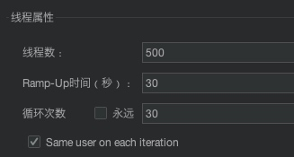
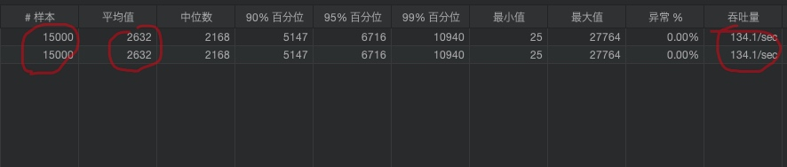
（2）线程数550,循环次数30

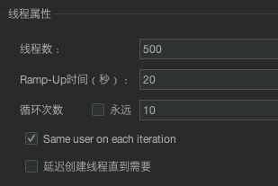
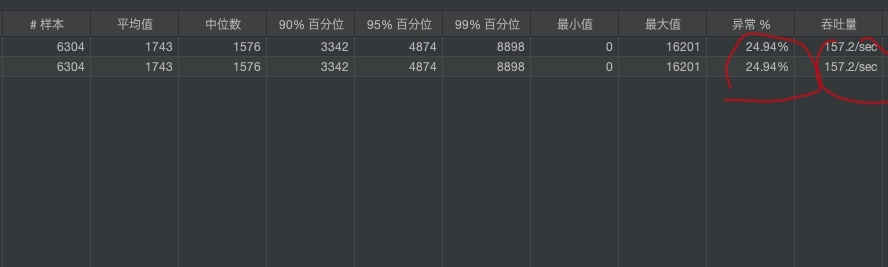
此时开始出现异常，停止测试，出现异常会增加吞吐量

**_综上常规秒杀压测吞吐量约为：130/s_**

<h4 id="2.5.2">【秒杀压测】增加缓存和异步扣减库存</h4>
（1）线程数800，循环次数100

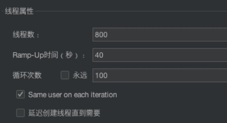
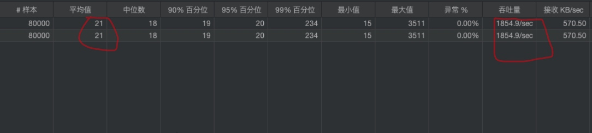
（2）线程数1000，循环次数100

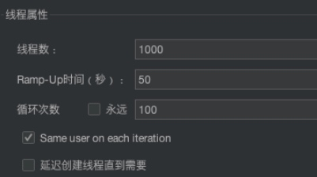
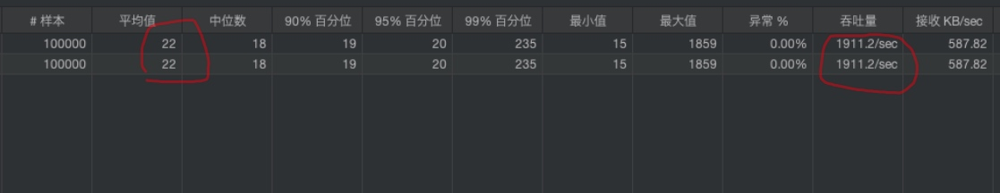

（3）线程数1200，循环次数100

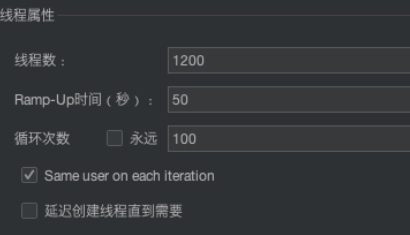
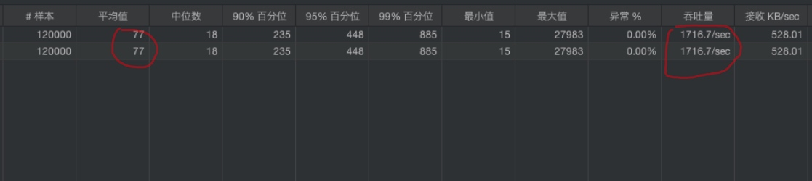

（3）线程数1500，循环次数100

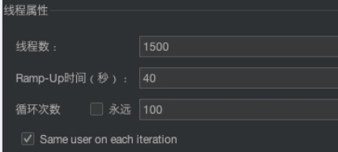
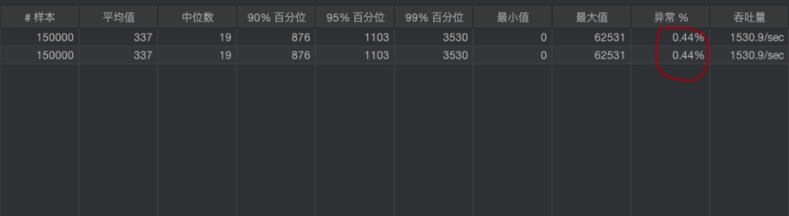

**_综上增加缓存和异步扣减库存秒杀压测，随着线程数的不断增大，延迟也变大了，吞吐量逐渐变小了一点，到了线程数1500，部分测试结果出现异常。
综合得出，增加缓存和异步扣减库存后秒杀吞吐量约为：1900/s_**
<h3 id="2.6">项目收获</h3>
- 通过该项目的开发，首次学习到了性能压测，进一步掌握了到了Redis的事务机制和持久化方式，对本地缓存和分布式缓存也有了更新层次的认识。
- 对缓存穿透、缓存击穿、缓存雪崩有了项目上的解决方案，首次学习了使用了RocketMQ消息队列，掌握了异步消息的事务流程，熟悉了削峰限流与防刷机制。
- 对电商项目有了全新的认识和理解，积攒了电商项目的开发经验，能在以后的开发中，灵活应用到不同的场景。
